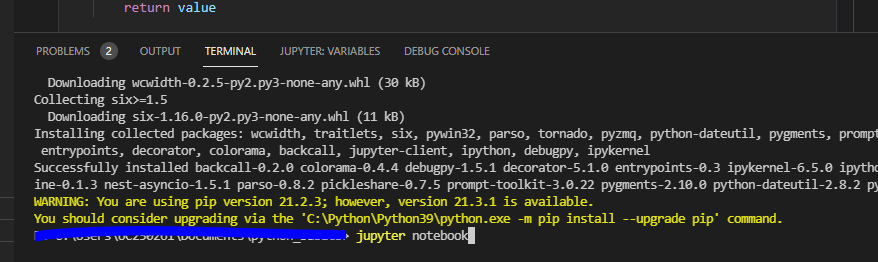
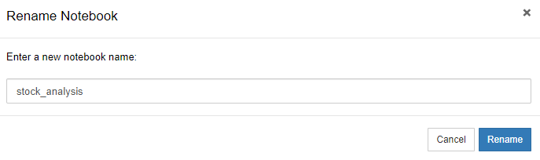

# Python_StockMarket_Data_Visualization

Hello!!!🥳

This is the Python Stock Market Data Visualization Repository. 

The Ultimate goal of this Python Project is to fetch Stock Market Data using Panda libraries and build Customized Candlestick charts on Jupyter Notebook for Data visualization with the help of Bokeh libraries. 

In this Python Project, I have used Pandas to handle data and Bokeh libraries for visualizing the data. 

### Pre-requisites for this project
- Python3.9
- Visual Studio Code 2019
- Jupyter Notebook
- Pandas_datareader Libraries
- Bokeh libraries

### So how do we get started?
#### Stage 1: Downloading Datasets with Python
Here we need some form of a data source like Yahoo for getting the price of Stock for a company (Like Paypal). For this, we will first need to install a library called pandas_datareader.

In order to get started, I first created a folder named Python Project on Desktop. Launch Visual Studio Code and open the folder that you recently created. Go ahead and click on Terminal (under Visual Studio Code) > New Terminal > Enter the command "pip install pandas_datareader'.

The next step is to use Jupyter Notebook
On your Visual Studio Code Terminal, go ahead and run the command "Jupyter Notebook"

You will then be directed to Jupyter Notebook service which will be running locally. 

In Jupyter Notebook, Click on New > Select Python 3 (ipykernal) > Renamed the Notebook as "Stock_Analysis"

Below are following lines of code which get  but before that I highly recommend you to check out code here [Pandas Data Reader for Yahoo Finance Data](https://pandas-datareader.readthedocs.io/en/latest/remote_data.html#remote-data-yahoo)

from pandas_datareader import data
import datetime
start=datetime.datetime(2021,8,1) #Enter the start date (YYYY,MM,DD)
end=datetime.datetime(2021,11,10) #Enter the end date (YYYY,MM,DD)
df=(data.DataReader(name="PYPL", data_source="yahoo",start=start,end=end))
df

Stage 2: Stock Market Data Candlestick Charts]
Now for all the data which has been obtained for a stock name "PYPL"(ticker for PAYPAL) , it is time to construct CandleStick Charts. Below are th lines of code that help to plot the rectangles and segments of the CandleStick Charts.

Before we get in coding, we will first need to install Bokeh Libraries. 

On Visual Studio Code, Navigate to your terminal and enter the below command to install Bokeh libraries
pip3 install bokeh

Also be sure to upgrade your Jupyter Notebook by entering the below command in order to avoid any failures when running creating Candlestick Charts
pip3 install notebook --upgrade

.png)

For data to be visualizated in the form of charts and to display the output file in an html format, we will need to include the following on our code:

from bokeh.plotting import figure, show, output_file

Python code below comprises of the following
A function to give us the high-low points, middle value point and overall height of the CandleStick
x-Axis
y-axis
Title
Hours in MilliSeconds
Candlestick Segments
Candlestick Rectangle
Output file in HTML format

Here is the 2nd part of Python Code
def inc_dec(c,o):
    if c > o:
        value="Increase"
    elif c < o:
        value="Decrease"
    else:
        value="Equal"
    return value

df["Status"]=[inc_dec(c,o) for c, o in zip(df.Close, df.Open)]

df["Middle"]=(df.Open+df.Close)/2
df["Height"]=abs(df.Close-df.Open)

p=figure(x_axis_type='datetime', width=1000, height=800)
p.title="CandleStick Chart"

hours_12=12*60*60*1000

p.segment(df.index, df.High, df.index, df.Low, color="Black")

p.rect(df.index[df.Status=="Increase"], df.Middle[df.Status=="Increase"], hours_12, df.Height[df.Status=="Increase"], fill_color="#7FFF00",line_color="black")

p.rect(df.index[df.Status=="Decrease"], df.Middle[df.Status=="Decrease"], hours_12, df.Height[df.Status=="Decrease"], fill_color="red",line_color="black")

output_file("CS.html")
show (p)

Overall Code:

from pandas_datareader import data
import datetime
from bokeh.plotting import figure, show, output_file

start=datetime.datetime(2021,8,1)
end=datetime.datetime(2021,11,10)

df=(data.DataReader(name="PYPL", data_source="yahoo",start=start,end=end))

def inc_dec(c,o):
    if c > o:
        value="Increase"
    elif c < o:
        value="Decrease"
    else:
        value="Equal"
    return value

df["Status"]=[inc_dec(c,o) for c, o in zip(df.Close, df.Open)]

df["Middle"]=(df.Open+df.Close)/2
df["Height"]=abs(df.Close-df.Open)

p=figure(x_axis_type='datetime', width=1000, height=800)
p.title="CandleStick Chart"

hours_12=12*60*60*1000

p.segment(df.index, df.High, df.index, df.Low, color="Black")

p.rect(df.index[df.Status=="Increase"], df.Middle[df.Status=="Increase"], hours_12, df.Height[df.Status=="Increase"], fill_color="#7FFF00",line_color="black")

p.rect(df.index[df.Status=="Decrease"], df.Middle[df.Status=="Decrease"], hours_12, df.Height[df.Status=="Decrease"], fill_color="red",line_color="black")

output_file("CS.html")
show (p)

Cheers!

Nitin Jagwani 
